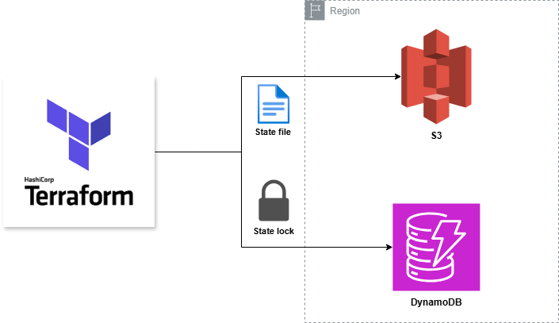

# Cloudride Technical Challenge - Chen Bello

## Overview
This repository contains the infrastructure and application code for a complete AWS deployment in region **eu-west-1**, using Terraform and ECS Fargate.  
It follows AWS best practices for modular design, scalability, and automation, with CI/CD integration through GitHub Actions.

## Architecture Diagram
VPC → Public Subnets (ALB) → Private Subnets (ECS Fargate Tasks) → ECR

## Deployment Steps
1. Initialize Terraform backend  
2. Apply the configurations in order: `bootstrap` → `network` → `ecs-fargate`  
3. Push code to GitHub — pipeline builds the image and updates ECS automatically  

---

## AWS Well-Architected Pillars

### Security
- IAM roles follow least privilege principles  
- ECS Task Execution Role limited to ECR and CloudWatch Logs  
- ALB exposes only port 80, ECS tasks accept traffic only from the ALB Security Group  
- No hard-coded credentials in the repository  

### Reliability
- Multi-AZ deployment (two private subnets across availability zones)  
- ECS service Auto Scaling  
- ALB health checks automatically replace unhealthy tasks  

### Performance Efficiency
- AWS Fargate for right-sized, serverless compute  
- ALB efficiently distributes requests across ECS tasks  

### Cost Optimization
- Single NAT Gateway to reduce costs  
- CloudWatch log retention policy (7 days) helps reduce storage costs  

### Operational Excellence
- Terraform for declarative IaC  
- Remote backend with S3 + DynamoDB for state and locking  
- GitHub Actions for CI/CD and ECS deployments  
- CloudWatch alarms and SNS for monitoring  

---

# cloudride-hello-world

## Interactive Hello World App on AWS ECS

This project demonstrates a simple yet dynamic Flask web application designed to deliver an **interactive "Hello World" experience**. The app displays a randomly animated greeting that changes automatically every few seconds, providing an engaging interface instead of a static page. It is deployed using **AWS ECS Fargate** with an **Application Load Balancer (ALB)** and **Auto Scaling** for high availability and performance — designed as part of the **CloudRide DevOps Challenge**.

---

## Features

- Python Flask web application
- Interactive front-end with auto-refreshing greetings
- Containerized with Docker
- Deployed using AWS ECS Fargate
- Accessible through an Application Load Balancer (ALB)
- Auto Scaling based on CPU utilization and ALB request count
- CI/CD pipeline powered by GitHub Actions

---

## Architecture Overview

| Component                    | Purpose                               |
|------------------------------|---------------------------------------|
| Amazon ECS Fargate           | Hosts the containerized application   |
| Application Load Balancer    | Routes traffic to the ECS service     |
| Auto Scaling                 | Adjusts the number of running tasks based on CPU usage and incoming request count |
| Amazon ECR                   | Stores Docker images                  |
| GitHub Actions               | Handles CI/CD automation              |

---

## Prerequisites

- AWS account with necessary IAM permissions  
- Terraform installed  
- Docker installed  
- GitHub repository with required secrets and variables  

---

## Deployment Instructions

### 1. Clone the Repository

```bash
git clone https://github.com/ChenBello/cloudride-challenge.git
cd cloudride-challenge
```

### 2. Configure Terraform Variables

Copy the example terraform.tfvars files for each stage (in this case, this is only needed for the 'ecs-fargate' stage):
```bash
cp infrastructure/bootstrap/terraform.tfvars.example infrastructure/bootstrap/terraform.tfvars
cp infrastructure/network/terraform.tfvars.example infrastructure/network/terraform.tfvars
cp infrastructure/ecs-fargate/terraform.tfvars.example infrastructure/ecs-fargate/terraform.tfvars
```
Update each terraform.tfvars file with your AWS, VPC, and application-specific settings.

### 3. (Optional) Build Docker Image Locally

If you want to build the Docker image locally, run the following commands:
```bash
cd application
docker build -t cloudride-flask-app .
```

### 4. Push the Image to ECR or Docker Hub

Follow the appropriate container registry instructions to log in and push the Docker image (either to ECR or Docker Hub).

### 5. Deploy Infrastructure with Terraform

The deployment is split into three stages. You need to apply the configurations in the following order:

#### Stage 1: Bootstrap

This stage sets up the Terraform backend (S3 bucket and DynamoDB table for locking). Run the following commands:
```bash
cd infrastructure/bootstrap
terraform init
terraform apply
```
#### Stage 2: Network

The second stage provisions the base networking layer (VPC, subnets, NAT, etc.). Run the following commands:
```bash
cd infrastructure/network
terraform init
terraform apply
```
#### Stage 3: ECS-Fargate

Finally, deploy the application on ECS Fargate. Run the following commands:
```bash
cd infrastructure/ecs-fargate
terraform init
terraform apply
```
### 6. Access the Application

The application will be accessible via the ALB DNS name output by Terraform. ECS Auto Scaling will automatically adjust the task count based on CPU usage and ALB request count.

This setup includes a CI/CD pipeline with GitHub Actions, which will trigger deployments when changes are pushed to the main branch. Additionally, the infrastructure is divided into separate modules (bootstrap, network, ecs-fargate) for better organization and isolation of state files.

---

## 📸 Screenshot of the Architecture

Here’s a diagram of the project’s architecture, showcasing the key components and how they interact. While the diagram illustrates the use of **AWS CodePipeline**, **AWS CodeDeploy** and **AWS CodeBuild** for CI/CD, in this project, **GitHub Actions** is used to manage the continuous integration and deployment process.


## Detailed ECS & ALB Architecture
The following diagrams illustrate how the system components interact — from internet traffic through Route 53, ALB, and into ECS Fargate tasks:

### Full AWS ECS Fargate Infrastructure
<p align="center">  </p>
This broader diagram captures the full infrastructure including VPC, subnets, ALB, ECS Service, Fargate Tasks, NAT Gateway, and Internet Gateway, reflecting the real AWS environment provisioned by Terraform.

### ALB and ECS Flow
<p align="center">  </p>
This diagram shows how the Application Load Balancer receives traffic from Route 53, uses a listener on port 80/443, and routes requests to a target group with IP-based Fargate tasks in private subnets.

---

## CI/CD with GitHub Actions

A GitHub Actions workflow is included for continuous deployment.

**Workflow File:** [`.github/workflows/DeployApp.yml`](https://github.com/ChenBello/cloudride-challenge/blob/main/.github/workflows/DeployApp.yml)

### What It Does

- Detects changes in the `application/` directory on push to `main`
- Builds and pushes the Docker image to Amazon ECR
- Triggers a new ECS deployment
- Sends a Slack notification on success or failure (Optional)
- Supports manual deployment via workflow dispatch
  
Here’s a visual overview of the workflow:


---

## GitHub Secrets (Settings → Secrets and variables → Actions)

| Name                  | Description                     |
|-----------------------|---------------------------------|
| AWS_ACCESS_KEY_ID     | IAM access key                  |
| AWS_SECRET_ACCESS_KEY | IAM secret key                  |
| AWS_ACCOUNT_ID        | AWS account ID                  |
| SLACK_WEBHOOK_URL     | Slack incoming webhook URL      |

---

## Repository Variables (Settings → Variables)

| Name                  | Description                             |
|-----------------------|-----------------------------------------|
| ECR_BACKEND_IMAGE     | Name of the ECR repository              |
| AWS_DEFAULT_REGION    | AWS region (e.g., eu-west-1)            |
| ECS_CLUSTER           | Name of the ECS cluster                 |
| ECS_BACKEND_SERVICE   | Name of the ECS service                 |

---

## Deployment Process Overview

1. Checkout repository
2. Authenticate with AWS and ECR
3. Build Docker image from `application/`
4. Push image to ECR with `latest` tag
5. Update ECS service to trigger new deployment
6. Send deployment status to Slack

---

## Example Slack Notifications

- Deployment succeeded
- Deployment failed

Messages include deployer info, commit message, ECS service, and cluster.

---
# Terraform State Management

This project uses a remote backend to store the Terraform state file securely:

- **S3 Bucket**: Stores the Terraform `.tfstate` file.
- **DynamoDB Table**: Handles state locking and consistency to avoid concurrent operations.

## Diagram

[](docs/images/state-file.drawio.png)

### 💡 Why S3 + DynamoDB?

Using **S3** to store the Terraform state file allows for versioning and persistence. By adding **DynamoDB** for state locking, we ensure that concurrent Terraform operations are safely handled, preventing conflicts during deployments. This setup is designed to enhance the reliability and scalability of infrastructure provisioning.

## Screenshot of the S3 Bucket Structure

Below you can find a screenshot of the actual S3 bucket structure used for Terraform state files:


---

## Terraform State Structure

This project follows an opinionated **modular structure** with separate Terraform states for better isolation, scalability, and management. The deployment is split into three main stages:

### Stages and State Files:

- **bootstrap**:  
  This stage is responsible for setting up the Terraform backend (S3 bucket and DynamoDB table for locking).
  - **State file path**: Stored locally during bootstrap (since the remote backend does not exist yet).
  - **Description**: Creates the Terraform backend (S3 bucket and DynamoDB table for locking).

- **network**:  
  This stage provisions the base networking layer.
  - **State file path**: `states/network/terraform.tfstate`
  - **Description**: Provisions the base networking layer: VPC, subnets, NAT, IGW, and route tables.

- **ecs-fargate**:  
  This stage deploys the application on ECS Fargate.
  - **State file path**: `states/ecs-fargate/terraform.tfstate`
  - **Description**: Deploys the application on ECS Fargate with ALB, Auto Scaling, and IAM.

### Key Points:
- The **bootstrap** stage is stored locally because the remote backend does not exist yet.
- The **network** and **ecs-fargate** stages use remote backends (S3 + DynamoDB) created during bootstrap, ensuring better separation and isolation between stages.
- Each environment can load outputs from the previous stage using `terraform_remote_state`, which ensures a loosely coupled and composable infrastructure design.

### Dependency Flow:

```text
bootstrap → network → ecs-fargate
